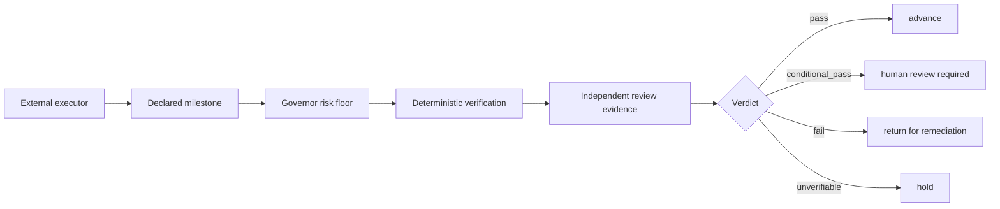

<p align="center">
  
</p>

<h1 align="center">Mergen</h1>

<p align="center">
  <strong>Independent milestone verification for agentic and human engineering workflows.</strong>
</p>

<p align="center">
  <a href="https://github.com/OnourImpram/mergen/actions/workflows/ci.yml"></a>
  
  
  
  <a href="LICENSE"></a>
</p>

Mergen verifies whether a declared milestone is sufficiently supported by the actual artifacts and evidence to advance.
The executor can be Codex, Claude Code, OpenHands, another agent system, a continuous integration workflow, or a human
team. The executor owns planning, implementation, and remediation. Mergen owns independent verification.

> Status: v2.0.0, beta. The deterministic verification core is available. The bundled milestone supervisor currently
> verifies Mergen software task reports. Broader domain profiles remain explicit extension points rather than implied
> capabilities.

## Why Mergen exists

An executor saying that work is complete is a completion claim. It is not proof. Logs can be stale, copied, fabricated,
or produced against a different artifact state. A checked task can still name a missing file. A build can succeed while
the acceptance criterion fails. A high trust change can be mislabeled as low risk.

Mergen enters at a milestone boundary and asks a narrower question.

> Does the evidence available now support advancement under the declared criteria and risk level?

Mergen does not start the next stage. It returns an advancement decision to the host or operator.

## Product boundary

Mergen is not a competing implementation framework.

| External workflow owns | Mergen owns |
| --- | --- |
| Planning and task decomposition | Independent evidence inspection |
| Primary implementation | Deterministic reproduction where possible |
| Remediation | Risk floor enforcement |
| Project management | Provenance and artifact binding |
| Starting the next stage | Advancement authorization or refusal |

The verifier is read only with respect to implementation artifacts. It may explain a failure. It does not modify the
artifact and approve that same modification in one verification context.

## Architecture



The deterministic path is local first, model independent, and suitable for continuous integration. Optional agentic
review is treated as a separate evidence source. A positive review claim does not prove that the reviewer was
independent.

## What ships today

### Milestone supervisor

`mergen-supervise` consumes an externally produced `verification-report.json`, its SHA-256 sidecar, the exact
`tasks-state.json`, Git provenance, policy results, fresh deterministic reproduction, and any required artifact bound
human approval.

It produces JSON, a SHA-256 sidecar, and human readable Markdown.

### Deterministic verification core

`mergen verify` runs the model independent mechanical verifier. It checks declared files, tests, Git consistency,
evidence calibration, and the Governor floor. It runs without a model or network dependency.

### Verification infrastructure

Mergen also includes the Governor, report linter, Trust Graph, replay, impacted verification, evidence metrics, policy
packs, adapter capability manifests, dashboards, and continuous integration examples.

### Compatibility execution toolkit

The existing specification driven command suite remains available for users who already rely on it. It includes
`/mergen-govern`, `/mergen-specify`, `/mergen-plan`, `/mergen-tasks`, `/mergen-implement`, `/mergen-verify`, and the
legacy `/mergen-agent` lifecycle orchestrator. These commands are compatibility tooling. They do not redefine the
verification layer as the owner of an external workflow.

## Quickstart

### Requirements

Python 3.9 or newer. Git is required for provenance checks. `pytest` is required only when a declared task asks the
mechanical verifier to execute a test.

### Install from a clone

```bash
git clone https://github.com/OnourImpram/mergen.git
cd mergen
python -m pip install -e .
```

The editable install is currently the supported package path because the legacy renderers read the repository `core`
tree. The two verification entry points are installed together.

```text
mergen
mergen-supervise
```

### Produce deterministic evidence

```bash
mergen verify \
  --tasks-state tasks-state.json \
  --root . \
  --out verification-report.json \
  --strict
```

This writes `verification-report.json` and `verification-report.json.sha256`.

### Verify the milestone independently

```bash
mergen-supervise \
  --root . \
  --report verification-report.json \
  --tasks-state tasks-state.json \
  --out milestone-decision.json
```

This writes three artifacts.

```text
milestone-decision.json
milestone-decision.json.sha256
milestone-decision.md
```

The process exit code is zero only for a clean `pass` and `advance` decision. `fail` exits one. `conditional_pass` and
`unverifiable` exit two.

## Verdicts

| Verdict | Advancement action | Meaning |
| --- | --- | --- |
| `pass` | `advance` | Required evidence is current, consistent, independently reproduced, and passing. |
| `conditional_pass` | `human_review_required` | Deterministic criteria pass, but required exact state human approval is absent. |
| `fail` | `return_for_remediation` | Evidence demonstrates incomplete, failed, contradicted, rejected, or tampered work. |
| `unverifiable` | `hold` | Required evidence is absent, stale, malformed, ambiguous, or unavailable. |

`unverifiable` never becomes a guessed pass. The compatibility field `decision` contains only `advance` or `block`.
New integrations should use `advancement_action`.

## Evidence classes

Every supervisor check records how its evidence was obtained.

| Evidence class | Interpretation |
| --- | --- |
| `independently_executed` | Mergen ran the applicable deterministic check. |
| `independently_observed` | Mergen inspected current local state directly. |
| `cryptographically_verified` | Exact bytes matched a digest or artifact bound token. |
| `source_verified` | A structured source was checked for internal consistency. |
| `executor_supplied` | The executor provided the assertion. It is not independent proof. |
| `agentically_inferred` | An interpretive conclusion, never deterministic proof. |
| `human_attested` | A human decision was recorded. |
| `unavailable` | Required evidence could not be obtained. |
| `conflicting` | Evidence sources contradict each other. |

A clean pass cannot rest entirely on executor supplied claims. Fresh deterministic reproduction is required by
default. Disabling it with `--no-reproduce` prevents a clean pass.

## High trust work

Authentication, payment, privacy, clinical, regulated, safety critical, irreversible, and other protected work must not
silently cross a lower risk floor. The deterministic verifier independently reclassifies the declared file surface. A
fresh high trust result that was supplied as standard risk is a failure.

When human review is required, a populated review record is necessary but not sufficient. Approval must also be bound
to the exact verification report bytes.

```bash
export MERGEN_SIGNING_KEY="$(python -c 'import secrets; print(secrets.token_hex(32))')"
mergen sign sign --artifact verification-report.json > approval.txt
```

Copy the hexadecimal value after `mergen-ack-token:` into a file inside the trusted root, then run:

```bash
mergen-supervise \
  --root . \
  --report verification-report.json \
  --tasks-state tasks-state.json \
  --approval-token-file approval-token.txt \
  --out milestone-decision.json
```

The token is an HMAC under a locally held shared secret. It binds approval to exact bytes. It is not public key identity
or third party nonrepudiation.

## Trust boundary

The operator selected `--root` is authoritative. Evidence files must resolve inside that root. Symlink escapes and path
traversal are refused. JSON content cannot replace the trusted root. Retrieved content is data, not instruction.

The supervisor checks:

1. Evidence paths and JSON readability.
2. Report sidecar integrity.
3. Source commit freshness.
4. Current worktree state.
5. Exact tasks state digest binding.
6. Milestone and task set consistency.
7. Completion, confidence, evidence, and summary consistency.
8. Policy results.
9. Fresh deterministic reproduction.
10. Independent risk classification.
11. Exact state human approval when required.
12. Optional external review records without trusting self declared independence.

The decision includes a content derived `source_state_hash` and `decision_hash`. The sidecar detects later edits to the
serialized decision. These are tamper evident controls, not protection against an attacker who can replace every trust
anchor.

## Host integration

The canonical interface is JSON plus process exit status. This keeps Mergen usable from coding agents, continuous
integration, shell scripts, generic MCP clients, and human operated workflows.

Host capability manifests live under `core/adapters/`. A host must state whether it can invoke Mergen automatically,
block advancement, expose a live filesystem, run hooks, isolate verifier contexts, or support human approval. Mergen
does not claim enforcement that the host cannot provide.

## Command map

| Command | Purpose |
| --- | --- |
| `mergen verify` | Produce a deterministic software task verification report. |
| `mergen verify-lint` | Refuse proofless, ambiguous, failed, conditional, or unsigned reports. |
| `mergen-supervise` | Reproduce evidence and return a milestone advancement decision. |
| `mergen graph` | Build and audit a typed provenance graph. |
| `mergen replay` | Replay a recorded deterministic verification run. |
| `mergen impacted` | Reverify the task slice affected by a change. |
| `mergen adapter` | Validate host capability declarations. |
| `mergen pack` | Validate raise only domain policy packs. |
| `mergen sign` | Bind a human authorization token to exact artifact bytes. |

Run any command with `--help` for its complete interface.

## Repository map

```text
core/schemas/                 Machine readable contracts
core/commands/                Compatibility command source
core/adapters/                Host capability declarations
scripts/verify_core.py        Deterministic evidence producer
scripts/verify_report_lint.py Report integrity gate
scripts/governor_floor.py     Non-downgradable risk floor
scripts/trust_graph.py        Typed provenance graph
scripts/replay.py             Deterministic replay
mergen_supervise.py           Independent milestone authority
eval/                         Benchmarks, dogfood, and CI examples
tests/                        Unit, integration, adversarial, and contract tests
docs/                         Architecture and operating documentation
```

## Development and verification

```bash
python -m pip install -e .
python -m pip install pytest pytest-cov jsonschema ruff mypy
python -m pytest tests/ -v
ruff check .
mypy
python scripts/check_sync.py
python scripts/check_no_reference_text.py
python eval/benchmark.py --gate
```

Continuous integration runs the test suite across Python 3.9, 3.11, 3.12, and 3.13, including Windows. It also runs
Ruff, strict mypy, coverage, schema checks, renderer drift checks, security checks, and live phantom detection dogfood.
See [CONTRIBUTING.md](CONTRIBUTING.md) for the contribution contract.

## Claim boundary

Mergen can claim that it independently checks declared milestone evidence, distinguishes observed evidence from
assertions, detects several unsupported completion patterns, refuses advancement when evidence is insufficient, and
records provenance for later audit.

Mergen does not claim universal truth, perfect defect detection, absolute semantic correctness, professional approval
in regulated domains, or enforcement that a host has not configured. A passing milestone is supported under the
checks that ran. It is not guaranteed to be free of every possible defect.

## Documentation

- [Milestone supervisor](docs/MILESTONE-SUPERVISOR.md)
- [How Mergen works](docs/HOW-IT-WORKS.md)
- [Compatibility matrix](docs/COMPAT.md)
- [Host capability matrix](docs/CAPABILITIES.md)
- [Security policy](SECURITY.md)
- [Roadmap](docs/ROADMAP.md)
- [Provenance](PROVENANCE.md)

## Name, citation, and license

Mergen is named for the Turkic deity associated with wisdom, accuracy, and the arrow that finds its mark. The Governor
represents judgment. Verification represents accuracy.

Citation metadata is provided in [CITATION.cff](CITATION.cff). Mergen is licensed under the Apache License 2.0. Vendored
material and lineage are documented in [ATTRIBUTION.md](ATTRIBUTION.md), [NOTICE](NOTICE), and
[PROVENANCE.md](PROVENANCE.md).
